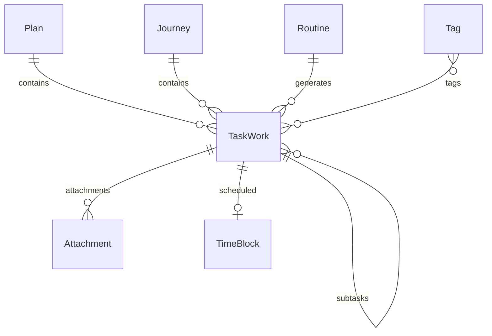

# System Map - iAlly
**Architecture:** MVVM (Model-View-ViewModel) + Service Layer  
**Tech Stack:** SwiftUI, SwiftData, CloudKit  
**Last Updated:** 2025-12-22

> **SDLC:** [Protocol](ORCHESTRATION_PROTOCOL.md) | [PRD](PRD.md) | [System Map](SYSTEM_MAP.md) | [Test Suite](TEST_SUITE.md) | [Context](CONTEXT_BUFFER.md) | [Changelog](CHANGELOG.md)

---

## 1. Directory Structure (Complete)

```
iAlly/
├── App/
│   ├── iAllyApp.swift (Entry Point)
│   └── AppConstants.swift
│
├── Models/ (SwiftData - 13 entities)
│   ├── TaskWork.swift (Core entity)
│   ├── Plan.swift (Life Domains)
│   ├── Journey.swift (Goals)
│   ├── Routine.swift (Recurring tasks)
│   ├── Tag.swift
│   ├── Attachment.swift
│   ├── TimeBlock.swift
│   ├── FocusSession.swift
│   ├── GrowthInsight.swift
│   ├── MindsetEvent.swift
│   ├── OfflineOperation.swift
│   ├── CustomView.swift
│   └── ExportURLWrapper.swift
│
├── Views/ (40+ files, 11 subdirectories)
│   ├── Core/
│   │   ├── TodayView.swift + TodayContentView.swift
│   │   ├── UpcomingView.swift + UpcomingContentView.swift
│   │   ├── InboxView.swift + InboxContentView.swift
│   │   └── MoreView.swift (Plans/Journeys browser)
│   ├── Details/
│   │   ├── TaskDetailView.swift
│   │   ├── PlanDetailView.swift
│   │   ├── JourneyDetailView.swift
│   │   └── RoutineDetailView.swift
│   ├── Add/
│   │   ├── AddTaskView.swift
│   │   ├── AddPlanView.swift
│   │   ├── AddJourneyView.swift
│   │   └── AddRoutineView.swift
│   ├── Components/
│   │   ├── TaskRowView.swift
│   │   └── SubtaskRow.swift
│   ├── TimeBlocking/
│   ├── Attachments/
│   ├── Analytics/
│   ├── CustomViews/
│   ├── Search/
│   ├── Settings/
│   ├── Tags/
│   └── Batch/
│       └── BatchActionsSheet.swift (NOT INTEGRATED)
│
└── Services/ (22 services)
    ├── DataSeederService.swift (Demo data)
    ├── NotificationManager.swift
    ├── AIInsightsService.swift
    ├── CloudSyncManager.swift (iCloud Sync)
    ├── CalendarManager.swift (EventKit)
    ├── GrowthMindsetService.swift
    ├── AnalyticsService.swift
    ├── ArchiveService.swift (NOT INTEGRATED)
    ├── AttachmentService.swift
    ├── BatchOperationService.swift (NOT INTEGRATED)
    ├── CustomViewService.swift
    ├── DataExportService.swift
    ├── IntentHandler.swift (Siri)
    ├── NaturalLanguageParser.swift (NOT INTEGRATED)
    ├── OfflineOperationQueue.swift
    ├── RecurrenceRuleBuilder.swift
    ├── RepositoryHelper.swift
    ├── RoutineManager.swift
    ├── SearchService.swift
    ├── ShortcutManager.swift
    ├── TagManager.swift
    └── WidgetHelper.swift
│
└── Widgets/
    ├── TodayWidget.swift
    └── GrowthStatsWidget.swift
│
└── Shortcuts/
    └── AddTaskIntent.swift
```

**Note:** Services marked "NOT INTEGRATED" exist in codebase but lack UI integration. See `PRD.md` Section 5.2 for details.

---

## 2. Data Flow

### Persistence Layer
- **SwiftData:** `ModelContext` injected into environment
- **Queries:** Views use `@Query` macro for reactive data fetching
- **State:** Local `@State` for view logic, `@Bindable` for data editing

### Demo Data
- **DataSeederService:** Populates initial state on first launch
- **Demo Flag:** All demo entities marked with `isDemo = true`
- **Cleanup:** Demo data can be removed via Settings

### Offline Support
- **OfflineOperationQueue:** Queues mutations when offline
- **CloudSyncManager:** Syncs when connection restored

---

## 3. Key Relationships



**Relationships:**
- **Plan** (1) ↔ (Many) **TaskWork**
- **Journey** (1) ↔ (Many) **TaskWork**
- **TaskWork** (Parent) ↔ (Many) **TaskWork** (Subtasks, max depth: 1)
- **Routine** (1) ↔ (Many) **TaskWork** (Generated instances)
- **Tag** (Many) ↔ (Many) **TaskWork**

---

## 4. External Integrations

| Integration | Framework | Purpose | Status |
|-------------|-----------|---------|--------|
| Calendar | EventKit | Time Blocking | ✅ Implemented |
| Notifications | UserNotifications | Reminders | ✅ Implemented |
| Widgets | WidgetKit | Home screen data | ⚠️ Partial (needs config) |
| Siri | AppIntents | Voice commands | ✅ Implemented |
| CloudKit | CloudKit | Cross-device sync | ✅ Implemented |

---

## 5. Architecture Patterns

### MVVM Implementation
- **Models:** SwiftData entities (passive data)
- **Views:** SwiftUI views (presentation)
- **ViewModels:** Implicit via `@Query` and Services (business logic)

### Service Layer
- **Singleton Services:** Shared instances (e.g., `GrowthMindsetService.shared`)
- **Dependency Injection:** `ModelContext` injected via environment
- **Separation of Concerns:** Each service handles one domain

---

**For implementation gaps, see `PRD.md` Section 5.**
